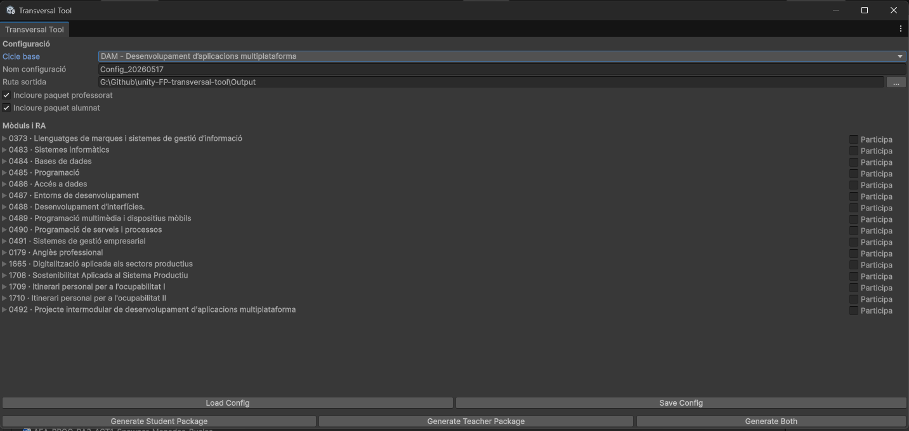

# Unity FP Transversal Tool



## Descripció

Aquest repositori conté un projecte Unity pensat com a eina transversal per als cicles formatius d'informàtica, especialment DAM i DAW. La proposta neix del Treball de Fi de Màster **"L'ús de motors de videojocs com a eina didàctica per a l'aprenentatge actiu als cicles formatius d'Informàtica"** i utilitza un videojoc base com a context comú per treballar activitats de diferents mòduls.

L'objectiu principal és reduir la fragmentació entre assignatures i facilitar que el professorat pugui proposar activitats connectades a un mateix projecte sense haver de mantenir una coordinació intensiva durant tot el curs. La tool permet seleccionar cicle, mòduls, resultats d'aprenentatge i activitats, i genera paquets diferenciats per a professorat i alumnat.

## Idees clau

- Projecte base en Unity amb un entorn 2D funcional.
- Finestra d'editor integrada a Unity per configurar la participació de cada mòdul.
- Catàleg curricular en JSON per a DAM i DAW.
- Activitats associades a resultats d'aprenentatge concrets.
- Generació automàtica de paquets per al professorat i per a l'alumnat.
- Activitats independents, avaluables com a scripts, JSON, SQL, documentació o altres fitxers.
- Parts no seleccionades lliurades ja resoltes per mantenir el projecte funcional.

## Context didàctic

En els cicles formatius d'informàtica, els continguts acostumen a organitzar-se per mòduls: Programació, Bases de dades, Llenguatges de marques, Sistemes, Entorns de desenvolupament, entre d'altres. Tot i que aquesta estructura és clara, pot provocar que l'alumnat percebi els aprenentatges com a peces aïllades.

La proposta utilitza Unity com a plataforma comuna perquè diferents assignatures puguin aportar funcionalitats a un mateix producte final. Per exemple:

- **Programació**: moviment del personatge, bucles, col·lisions, herència, persistència o integració amb bases de dades.
- **Bases de dades**: model relacional, consultes, normalització, procediments o dades de progrés.
- **Llenguatges de marques**: fitxers JSON/XML, validació, transformacions, estils o serialització.
- **Accés a dades**: persistència d'una partida o repositoris de dades.
- **Entorns de desenvolupament**: proves, documentació, diagrames, depuració i fases de projecte.

Segons el TFM, els qüestionaris realitzats apunten a una necessitat clara de millorar la connexió entre mòduls: 57 respostes d'alumnat i 20 de professorat indiquen una valoració positiva del projecte comú, de la coordinació entre assignatures i de l'ús d'un motor de videojocs com a context aplicat.

## Requisits

- Unity **6000.3.6f1** o compatible.
- Suport per a projectes 2D.
- Sistema d'entrada de Unity Input System inclòs al projecte.
- Git recomanat per controlar canvis abans de generar paquets.

## Com obrir el projecte

1. Clona o descarrega aquest repositori.
2. Obre Unity Hub.
3. Afegeix la carpeta del projecte.
4. Obre'l amb Unity 6000.3.6f1.
5. Espera que Unity importi els assets i regeneri la `Library`.

La tool es troba al menú:

```text
Tools > Transversal Tool > Package Generator
```

## Ús de la Transversal Tool

1. Obre la finestra des del menú de Unity.
2. Selecciona el cicle base: DAM o DAW.
3. Escriu un nom de configuració.
4. Tria la ruta de sortida.
5. Marca si vols generar paquet de professorat, alumnat o tots dos.
6. Desplega els mòduls i marca els que participen.
7. Dins de cada mòdul, selecciona els RA que es treballaran.
8. Marca les activitats concretes associades a cada RA.
9. Desa la configuració si la vols reutilitzar.
10. Genera el paquet desitjat.

La configuració es pot guardar i carregar en JSON, fet que permet preparar diferents grups, cursos o combinacions de mòduls sense refer tota la selecció.

## Sortida generada

La generació crea una estructura semblant a aquesta:

```text
Output/
  ConfigName/
    Professor/
      UnityProject/
        Assets/
        Packages/
        ProjectSettings/
      Docs/
        README_Professor.md
        ConfigSummary.json
    Alumnes/
      UnityProject/
        Assets/
        Packages/
        ProjectSettings/
      Exercicis/
        [Mòdul]/
          [RA]/
            Enunciat/
            Recursos/
            Plantilla/
            Entrega/
      Docs/
        README_Alumnes.md
        ConfigSummary.json
```

El paquet de **Professor** conté el projecte resolt. El paquet d'**Alumnes** conté plantilles incompletes només per a les activitats seleccionades; les parts no treballades es copien resoltes per evitar bloquejos i mantenir la coherència del videojoc.

## Estructura principal del repositori

```text
Assets/
  _Scripts/                         Scripts del videojoc base
  ArtRecursos/                      Sprites, fonts, animacions i recursos visuals
  Scenes/                           Escenes del projecte
  Prefabs/                          Prefabs principals del joc
  TransversalTool/
    Editor/                         Finestra d'editor i generador de paquets
    Runtime/                        Models i utilitats compartides
    Data/
      Curriculum/                   Catàleg curricular DAM/DAW
      Activities/                   Definició de les activitats
    Templates/
      Student/                      Plantilles per a l'alumnat
      Teacher/                      Solucions per al professorat
    Documentation/
      Statements/                   Enunciats de les activitats
      AEA/                          Activitats d'ensenyament-aprenentatge
Packages/
ProjectSettings/
```

## Dades i activitats

La tool funciona de manera orientada a dades:

- `Assets/TransversalTool/Data/Curriculum/unity_transversal_tool_curriculum_catalog.json` defineix cicles, mòduls i RA.
- `Assets/TransversalTool/Data/Activities/activities.json` associa activitats a mòduls i RA.
- Les plantilles de l'alumnat es troben a `Assets/TransversalTool/Templates/Student`.
- Les solucions del professorat es troben a `Assets/TransversalTool/Templates/Teacher`.
- Els enunciats es troben a `Assets/TransversalTool/Documentation/Statements`.

Per afegir una activitat nova, cal crear els fitxers de plantilla i solució, afegir l'enunciat i registrar l'activitat a `activities.json` indicant:

- `id`
- `title`
- `type`
- `deliverableType`
- `moduleCode`
- `learningOutcomeId`
- `studentTemplatePaths`
- `teacherSolutionPaths`
- `statementPaths`
- `resourcePaths`
- `targetPaths`

## Exemple d'activitat

Una activitat de Programació pot demanar a l'alumnat implementar un spawner de monedes amb un bucle `for`. L'estudiant rep una plantilla de C# i un enunciat; el professorat conserva la solució completa. El resultat es pot veure dins del nivell de Unity, però el lliurable continua sent un fitxer independent que es pot avaluar sense corregir tot el projecte.

## Validacions implementades

Abans de generar paquets, la tool comprova:

- que la configuració existeix i té nom;
- que la ruta de sortida és vàlida;
- que s'ha seleccionat un cicle existent;
- que els mòduls marcats tinguin algun RA actiu o mostrin un avís;
- que existeixin plantilles, solucions, enunciats i recursos declarats;
- que no se sobreescrigui una exportació prèvia sense confirmació.

## Estat actual

El projecte inclou la finestra d'editor, el model de dades, la càrrega de catàlegs, la persistència de configuracions i el generador de paquets. També incorpora activitats inicials per a Programació, Bases de dades, Llenguatges de marques, Accés a dades i Entorns de desenvolupament, a més de documentació AEA associada a diversos resultats d'aprenentatge.

## Treball futur

- Millorar la presentació dels README generats dins dels paquets.
- Afegir més activitats per a mòduls encara no coberts.
- Incorporar exportacions més detallades per a seguiment docent.
- Afegir proves automatitzades del generador de paquets.
- Revisar la codificació dels JSON curriculars si apareixen caràcters mal interpretats en algun entorn.

## Llicència i recursos

El projecte utilitza recursos visuals 2D i materials docents interns del repositori. Abans de reutilitzar-lo en un altre context, revisa les llicències dels assets inclosos i adapta les activitats a la programació didàctica del centre.
